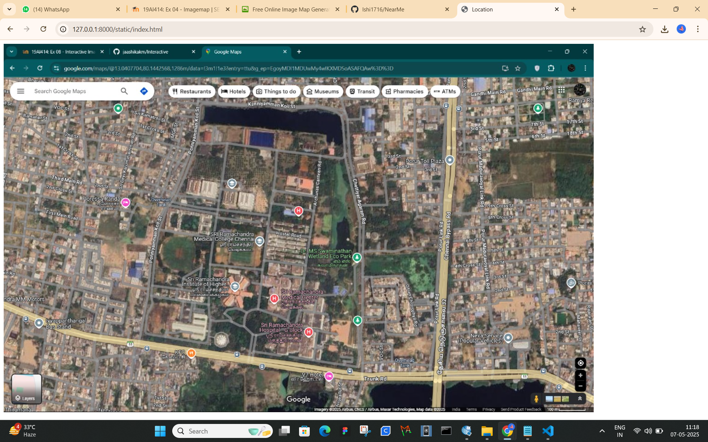
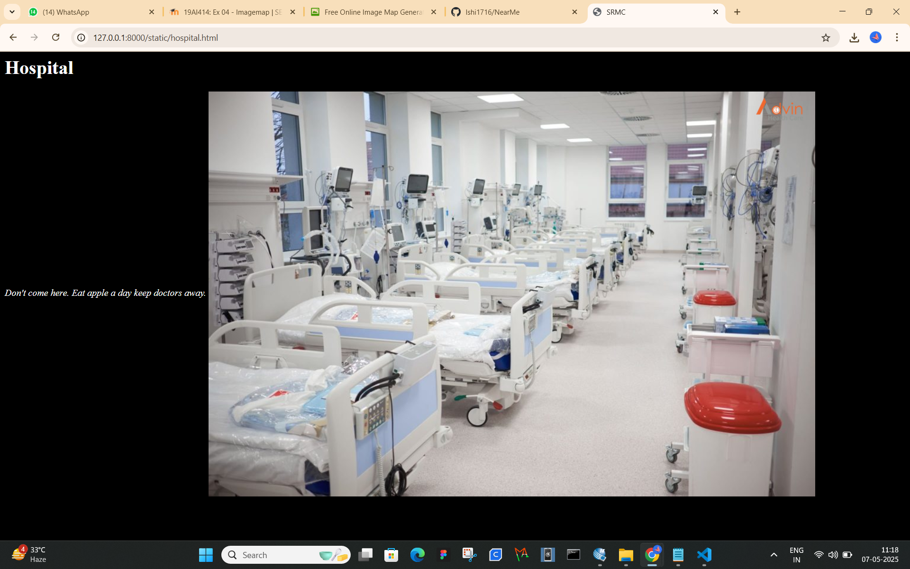
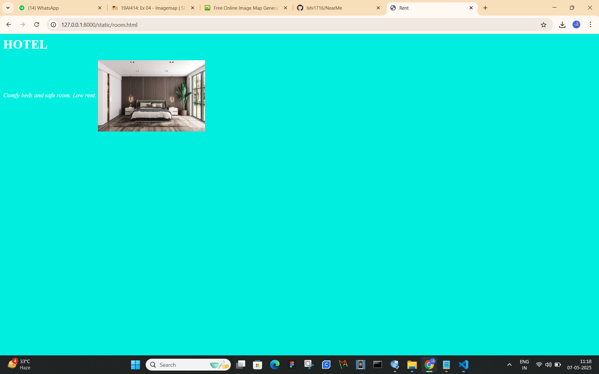
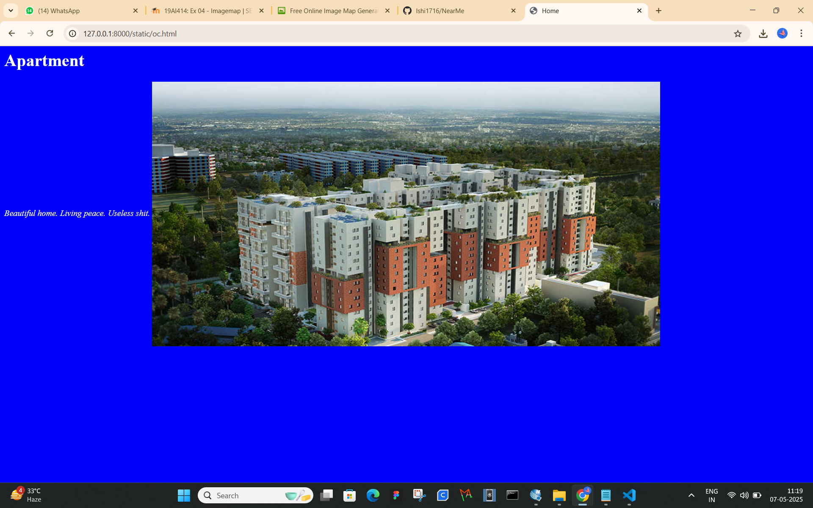

# Ex04 Places Around Me
## Date: 

## AIM
To develop a website to display details about the places around my house.

## DESIGN STEPS

### STEP 1
Create a Django admin interface.

### STEP 2
Download your city map from Google.

### STEP 3
Using ```<map>``` tag name the map.

### STEP 4
Create clickable regions in the image using ```<area>``` tag.

### STEP 5
Write HTML programs for all the regions identified.

### STEP 6
Execute the programs and publish them.

## CODE
```
index.html 
<!DOCTYPE html>
<html>
    <head>
        <title>Location</title>
    </head>
    <body>
        
        <map name="image-map">
            <area target="" alt="Hospital" title="Hospital" href="hospital.html" coords="410,458,568,400" shape="rect">
            <area target="" alt="Oc" title="Oc" href="oc.html" coords="841,569,76" shape="circle">
            <area target="" alt="OYO" title="OYO" href="room.html" coords="162,323,288,370" shape="rect">
        </map>
    </body>
</html>

Hospital.html
<html>
    <head><h1>Hospital</h1></head>
    <title>SRMC</title>
    <body text="white" bgcolor="black">
        <i>Don't come here. Eat apple a day keep doctors away.</i>
        
    </body>
</html>

oc.html
<html>
    <head><h1>Apartment</h1></head>
    <title>Home</title>
    <body text="white" bgcolor="blue">
        <i>Beautiful home. Living peace. Useless shit.</i>
        
    </body>
</html>

room.html
<html>
    <head><h1>HOTEL</h1></head>
    <title>Rent</title>
    <body text="white" bgcolor="greeen">
        <i>Comfy beds and safe room. Low rent.</i>
        
    </body>
</html>
```

## OUTPUT









## RESULT
The program for implementing image maps using HTML is executed successfully.
